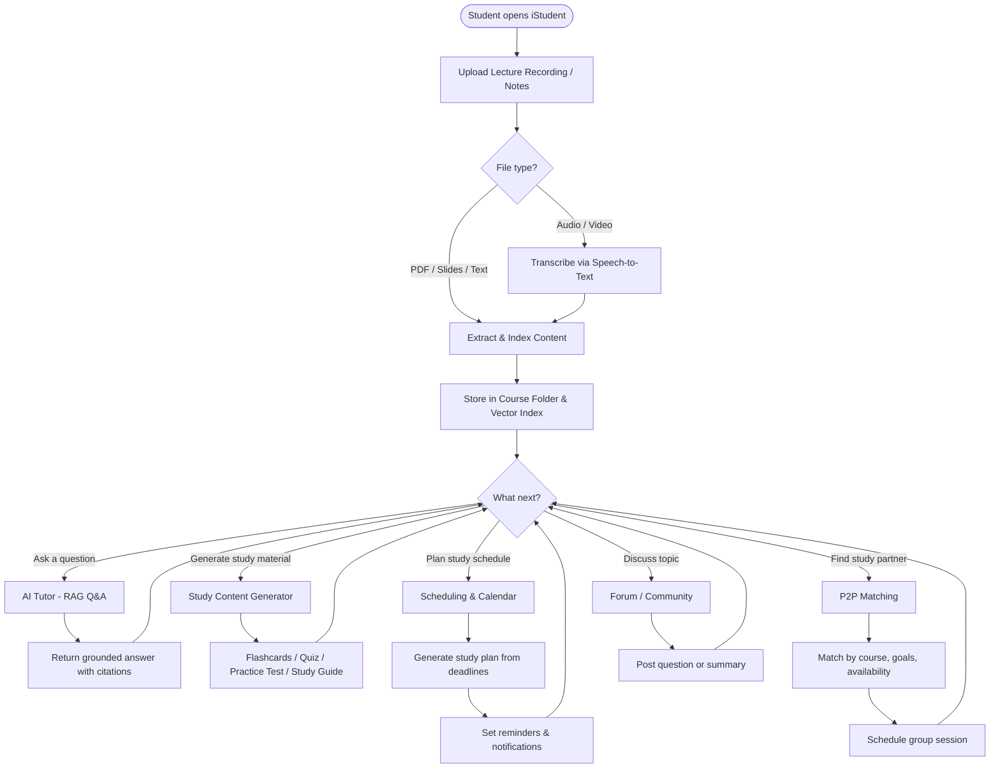

# Activity Diagram

End-to-end activity flow for the iStudent AI-Powered Student Workspace.

## Description

The activity diagram describes end-to-end flows including:

1. **Upload & Capture** – Student uploads a lecture recording or notes.
2. **Transcription** – Audio/video files are transcribed via speech-to-text.
3. **Indexing** – Content is extracted, indexed, and stored in the course folder and vector index.
4. **AI Tutoring** – Student asks questions and receives grounded answers with citations.
5. **Study Content Generation** – Flashcards, quizzes, practice tests, and study guides are generated from materials.
6. **Scheduling** – Study plans are created from deadlines with reminders and notifications.
7. **P2P Matching** – Students find study partners matched by course, goals, and availability.
8. **Forum / Community** – Students discuss topics and share AI-generated summaries.

> **Note:** This diagram will be refined further in the next sprint with additional decision points and data update flows.
