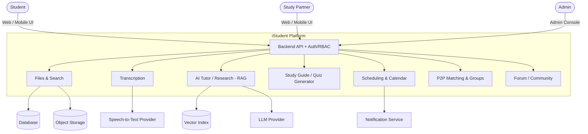

# Context Diagram

System context diagram for the iStudent AI-Powered Student Workspace.

## Description

At a high level, the AI Study Workspace is the central system. Students, peers, and admins access the platform through the web UI. Core services include file management, transcription, grounded AI tutoring (RAG), study content generation, scheduling, P2P matching, and forums. External services include the database, object storage, vector index, LLM provider, speech-to-text provider, and notifications.
